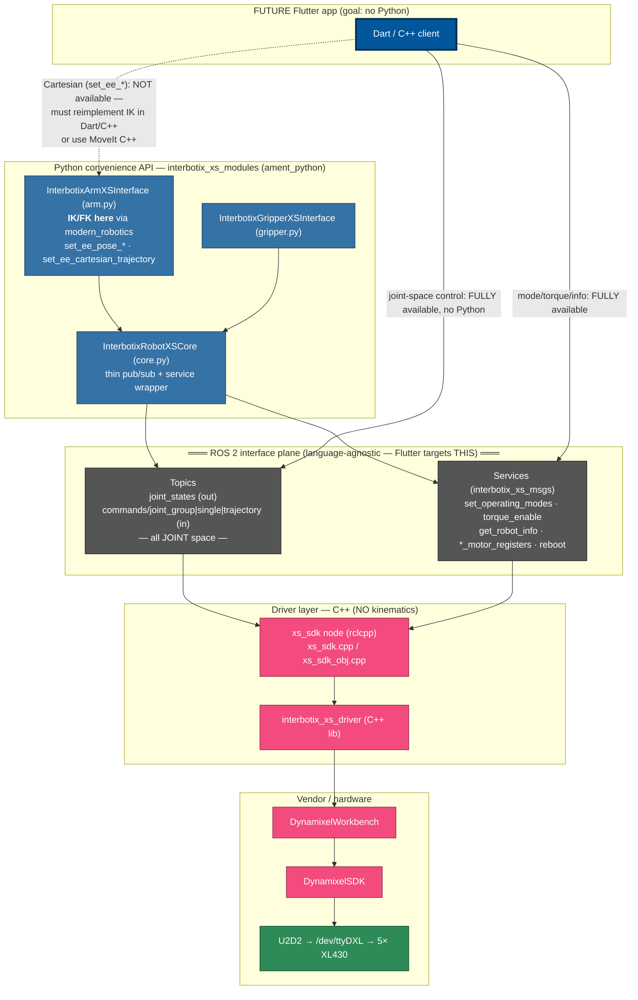
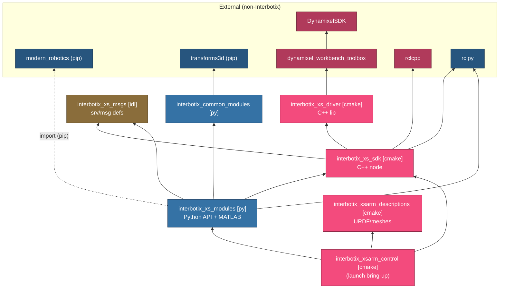

# Interbotix Python/C++ boundary analysis — control path

Date: 2026-05-29

Code-level analysis of the Interbotix X-series software stack, scoped
to the **PincherX-100 control path**. The goal is to locate the exact
Python/C++ boundary so that future Flutter applications — built
**beyond and independently of this runbook's Phase 7** — can interact
directly with C++ and/or the ROS 2 graph and avoid any Python in the
runtime path.

All findings are cited to source by `file:line`. No third-party
sources; everything below is read directly from the Interbotix
upstream repositories (see [Source provenance](#source-provenance)).

## TL;DR — what a Flutter app can reach without Python

1. **The C++ `xs_sdk` node exposes a joint-level ROS 2 interface, and
   that is the *entire* hardware interface.** A Flutter client speaking
   ROS 2 directly to `xs_sdk` gets 100% of joint-space control, joint
   state, and all motor/mode/torque/register/info services — with zero
   Python in the path.
2. **The C++ driver does no kinematics.** A search for IK / Jacobian /
   `modern_robotics` across `interbotix_xs_sdk/src` and
   `interbotix_xs_driver/src` returns nothing — the driver is
   joint-level only.
3. **All Cartesian / end-effector math (IK/FK) lives in Python**, in
   `arm.py`, computed client-side via the `modern_robotics` pip package,
   which then publishes plain **joint** commands to the same C++ node.
   This is the one capability a Python-free Flutter client loses and
   must replace (port IK to Dart/C++, or use MoveIt's C++ interface).
4. **There is no C++ port of the high-level `InterbotixManipulatorXS`
   convenience API.** It exists only in Python and MATLAB. The C++
   user-facing options are MoveIt (`InterbotixMoveItInterface`),
   the ros2_control hardware interface, or talking to `xs_sdk` directly
   over `interbotix_xs_msgs`.

## The language-agnostic interface (what `xs_sdk` exposes)

These are the only ROS 2 endpoints the hardware path provides. A
non-Python client targets exactly this set. Declared in
`interbotix_xs_sdk/include/interbotix_xs_sdk/xs_sdk_obj.hpp:102-132`;
message/service definitions in `interbotix_xs_msgs`.

| Kind | Name | Type | Space |
|---|---|---|---|
| Publisher | `joint_states` | `sensor_msgs/JointState` | joint |
| Subscription | `commands/joint_group` | `interbotix_xs_msgs/JointGroupCommand` | joint |
| Subscription | `commands/joint_single` | `interbotix_xs_msgs/JointSingleCommand` | joint |
| Subscription | `commands/joint_trajectory` | `interbotix_xs_msgs/JointTrajectoryCommand` | joint |
| Service | `set_motor_pid_gains` | `interbotix_xs_msgs/MotorGains` | — |
| Service | `set_operating_modes` | `interbotix_xs_msgs/OperatingModes` | — |
| Service | `set_motor_registers` | `interbotix_xs_msgs/RegisterValues` | — |
| Service | `get_motor_registers` | `interbotix_xs_msgs/RegisterValues` | — |
| Service | `get_robot_info` | `interbotix_xs_msgs/RobotInfo` | — |
| Service | `torque_enable` | `interbotix_xs_msgs/TorqueEnable` | — |
| Service | `reboot_motors` | `interbotix_xs_msgs/Reboot` | — |

Topic/service names are relative to the robot namespace (e.g.
`/px100/joint_states`).

### Where the kinematics actually live

- **C++ driver — none.** No IK/FK/Jacobian in
  `interbotix_xs_sdk/src` or `interbotix_xs_driver/src`.
- **Python `arm.py` — client-side.**
  `set_ee_pose_matrix` calls `mr.IKinSpace(...)`
  (`xs_robot/arm.py:524`); FK via `mr.FKinSpace(...)`
  (`xs_robot/arm.py:760, 828`). The px100 screw-axis description
  used by the solver is in `xs_robot/mr_descriptions.py`.
  `modern_robotics` is an external pip dependency, not a ROS package.

So `set_ee_pose_components` / `set_ee_cartesian_trajectory` are pure
Python convenience: solve IK in Python → publish joint commands to the
C++ node's `commands/*` topics.

## 1. Component diagram (runtime view)

Everything below the "ROS 2 interface plane" is C++ and reachable
directly. The Python API sits *above* the plane as just another client;
a Flutter client sits beside it.

## 2. Package diagram (build-time / dependency view)

Build types in labels: `[cmake]` = `ament_cmake`, `[py]` =
`ament_python`, `[idl]` = `rosidl` (interface generation). Edges are
`<depend>` / `<exec_depend>` relations from each `package.xml`. The only
`ament_python` packages are the API layer; the entire
`interbotix_xs_msgs → interbotix_xs_sdk → interbotix_xs_driver →
DynamixelWorkbench → DynamixelSDK` chain is C++.

### Control-path packages and build types

| Package | Build type | Language | Role |
|---|---|---|---|
| `interbotix_xsarm_control` | `ament_cmake` | (launch/config) | bring-up launch for the arm |
| `interbotix_xs_modules` | `ament_python` | Python + MATLAB | high-level API (`InterbotixManipulatorXS`, IK/FK) |
| `interbotix_common_modules` | `ament_python` | Python | shared angle/transform helpers |
| `interbotix_xs_sdk` | `ament_cmake` | C++ (+ `xs_sdk_sim.py`) | the driver node |
| `interbotix_xs_msgs` | `ament_cmake` (rosidl) | IDL | srv/msg/action definitions |
| `interbotix_xs_driver` | `ament_cmake` | C++ | low-level driver library |
| `interbotix_xsarm_descriptions` | `ament_cmake` | (URDF/meshes) | robot description |

## Conclusion — Flutter architecture decision

| What Flutter needs | Reachable without Python? | How |
|---|---|---|
| Read joint states | ✅ Yes | subscribe `joint_states` (`sensor_msgs/JointState`) |
| Joint-space commands | ✅ Yes | publish `JointGroupCommand` / `JointSingleCommand` / `JointTrajectoryCommand` |
| Set modes / torque / gains / read registers / robot info | ✅ Yes | the 7 `interbotix_xs_msgs` services |
| **Cartesian / EE pose control** (`set_ee_pose_*`, `set_ee_cartesian_trajectory`) | ❌ No — Python-only | reimplement IK/FK (port `modern_robotics` IKinSpace + the px100 screw-axis description from `mr_descriptions.py`) in Dart/C++, **or** call MoveIt's C++ `InterbotixMoveItInterface` |

A Flutter client can speak ROS 2 directly to the C++ driver for all
joint-level work. The one design decision to make early is **where
Cartesian IK lives** once Python is dropped: port `modern_robotics`
(a small, well-defined screw-theory library; the px100 is only 4-DOF)
versus delegating to MoveIt C++.

A separate, larger decision — out of scope for this code analysis — is
the **transport** the Flutter app uses to reach the ROS 2 graph
(`zenoh-bridge-ros2dds`, `zenoh-pico` FFI, or an `rclc`/`rclcpp`
binding). See `research/docker-architecture.md` for the Zenoh
transport findings.

## Source provenance

Read directly from these upstream repositories (local clones at
`/home/hugo/robots/pincherx_100/git/`):

| Repository | Branch | Commit |
|---|---|---|
| `Interbotix/interbotix_ros_core` | `lyrical` | `d0fa6cf` |
| `Interbotix/interbotix_ros_toolboxes` | `lyrical` | `2a2d4b7` |
| `hugo-bluecorn/interbotix_xs_driver` (fork) | `lyrical` | `8dd1a97` |

Key files:

- `interbotix_ros_core/interbotix_ros_xseries/interbotix_xs_sdk/include/interbotix_xs_sdk/xs_sdk_obj.hpp:102-132`
  — declared publishers, subscriptions, services.
- `interbotix_ros_core/interbotix_ros_xseries/interbotix_xs_sdk/src/xs_sdk.cpp:33`
  — `main()` instantiates `interbotix_xs::InterbotixRobotXS` via `rclcpp`.
- `interbotix_ros_core/interbotix_ros_xseries/interbotix_xs_msgs/`
  — `msg/` and `srv/` interface definitions.
- `interbotix_ros_toolboxes/interbotix_xs_toolbox/interbotix_xs_modules/interbotix_xs_modules/xs_robot/arm.py:524, 760, 828`
  — client-side IK/FK via `modern_robotics`.
- `interbotix_ros_toolboxes/interbotix_xs_toolbox/interbotix_xs_modules/interbotix_xs_modules/xs_robot/mr_descriptions.py`
  — px100 screw-axis description.
- `package.xml` of each control-path package — build types and depends.
