# Path B — C++ Cartesian gateway node (Flutter-over-Zenoh, no Python)

Date: 2026-05-29

Third in the analysis chain for Python-free Flutter control of the
PincherX-100, after
[`interbotix-python-cpp-boundary.md`](interbotix-python-cpp-boundary.md)
(*what's lost by dropping Python* — the Cartesian IK/FK layer) and
[`cpp-kinematics-alternatives.md`](cpp-kinematics-alternatives.md)
(*how to replace it* — the C/C++ kinematics landscape, framed as Path A
"link IK into the app via FFI" vs Path B "IK in a C++ ROS 2 node the app
calls over Zenoh").

This document expands **Path B** in full. **Path A is deferred** for now.

> Scope note: this is design analysis, not a runbook phase. It is
> independent of and beyond the docker-lyrical runbook's Phase 7
> hello-world Flutter subscriber — it describes the durable Bluecorn
> control architecture.

## TL;DR

A new C++ ROS 2 node — the **Cartesian gateway** (`px100_cartesian_gateway`)
— runs in the robot container alongside `xs_sdk` and `rmw_zenohd`. It
computes FK/IK, drives the arm through the existing `xs_sdk` interface,
and exposes a Flutter-facing endpoint over Zenoh. Two findings shape the
design:

1. **The Cartesian layer is much more than `IKinSpace`.** It carries a
   4-DOF pose convention, multi-seed IK, joint/velocity-limit checks, a
   straight-line trajectory interpolator, and motor-register-based timing.
   The gateway must replicate all of it (see scope table).
2. **A raw Zenoh/Dart client cannot practically invoke a stock ROS 2
   service over rmw_zenoh** (mandatory attachment/GID/type-hash
   handshake), and **there is no CDR library for Dart.** Therefore the
   gateway should expose its **own plain Zenoh queryable with a JSON
   schema**, and republish ee state as JSON — so Flutter touches neither
   CDR nor the ROS service mapping.

**Recommended configuration:** B-PoE kinematics engine (port
`modern_robotics` to Eigen for exact parity, reusable later in Path A) +
JSON Zenoh-queryable gateway that **executes** motions (Flutter stays
JSON-only). Estimated ~1 week to a verified "Flutter button → arm moves."

## What the gateway must replicate

The Cartesian layer in `interbotix_xs_modules/xs_robot/arm.py` is not just
an IK call. Verified behaviors the gateway must reproduce:

| Behavior | Source (`arm.py`) | Detail |
|---|---|---|
| **4-DOF pose convention** | `:587-602` | `yaw = atan2(y, x)` is **forced** for arms with <6 DOF (the waist points at the target). Genuine task space is `(x, y, z, pitch)`; `roll` is not independently controllable. |
| **Multi-seed IK** | `:223-225, :523-531` | 3 seeds tried in order: all-zeros, waist −120°, waist +120°. Tolerances `eomg = ev = 0.001`. |
| **Wrap + joint/velocity limits** | `:536-537, :321-340` | wrap θ to canonical range; reject NaN; check **position and velocity** limits (`velocity = |goal − current| / moving_time`). |
| **Cartesian straight-line trajectory** | `:607-719` | build virtual yaw frame `T_sy`; interpolate `N = moving_time / wp_period` waypoints (default 20 Hz, `wp_period = 0.05`); seed each waypoint's IK with the previous solution; emit one `JointTrajectoryCommand`. For 4-DOF, `y` and `yaw` deltas **must be 0** (`:652-656`). |
| **Timing = motor registers** | `:282-319` | `set_trajectory_time` writes `Profile_Velocity = int(moving_time*1000)` and `Profile_Acceleration = int(accel_time*1000)` via the **`set_motor_registers` service** (`RegisterValues`). The Dynamixels run the trapezoidal profile onboard; point-to-point motion is **not** host-interpolated. |
| **Publish path** | `:251-274` | `_publish_commands` → `JointGroupCommand` (point-to-point); trajectory path → `JointTrajectoryCommand`. |
| **FK + state** | `:749-760, :825` | `FKinSpace(M, Slist, joint_states)` for actual ee pose; maintains `T_sb` (commanded pose) and `joint_commands`. |
| **Joint-limit source** | — | from the `get_robot_info` (`RobotInfo`) service. |

The arm-driving side is exactly the language-agnostic `xs_sdk` interface
documented in the boundary analysis: subscribe `joint_states`; publish
`JointGroupCommand` / `JointTrajectoryCommand`; call `set_motor_registers`
(+ `set_operating_modes`, `get_robot_info`).

The px100 kinematic constants are already in source
(`mr_descriptions.py:65-74`): `Slist` is a 6×4 matrix of joint screw axes
in the space frame; `M` is the home-config ee pose. Space frame =
`base_link`, ee frame = `ee_gripper_link`.

## Architecture

```mermaid
flowchart LR
    subgraph phone["Phone — Flutter (no Python, no CDR)"]
        dart["package:zenoh<br/>z_get + z_subscribe<br/>JSON payloads"]:::tgt
    end

    subgraph robot["robot container"]
        router["rmw_zenohd"]:::z
        subgraph gw["px100_cartesian_gateway (NEW C++ node)"]
            zside["raw Zenoh session<br/>queryable: px100/ee/move (JSON)<br/>publisher: px100/ee/state (JSON)"]:::cpp
            kin["kinematics engine<br/>FK/IK + 4-DOF pose convention<br/>+ trajectory interpolation"]:::cpp
            rosside["rclcpp:<br/>sub joint_states · pub JointGroup/Trajectory<br/>call set_motor_registers / get_robot_info"]:::cpp
        end
        xs["xs_sdk (C++ driver)"]:::cpp
        hw["U2D2 → px100"]:::hw
    end

    dart -- "z_get move{x,y,z,pitch,t}" --> router
    router --> zside
    zside --> kin --> rosside
    rosside -- "JointGroupCommand / JointTrajectoryCommand" --> xs
    rosside -- "set_motor_registers (timing)" --> xs
    xs --> hw
    xs -- "joint_states" --> rosside
    rosside --> kin
    kin -- "ee pose JSON" --> zside
    zside -- "state stream" --> router --> dart

    classDef cpp fill:#f34b7d,color:#fff,stroke:#8c2845;
    classDef z fill:#7a3ea8,color:#fff,stroke:#3f2057;
    classDef tgt fill:#02569B,color:#fff,stroke:#012c50,stroke-width:3px;
    classDef hw fill:#2e8b57,color:#fff,stroke:#13452a;
```



## Decision 1 — kinematics engine

| | **B-PoE (port modern_robotics to Eigen)** | **B-KDL (kdl_parser + Orocos KDL)** |
|---|---|---|
| Parity with current arm | **Exact** — same `Slist`/`M`, `eomg/ev`, seeds | Behaviorally different; needs tuning |
| 4-DOF underactuation | Handled as today: fully-specified `T_sd` with `yaw = atan2(y,x)` | `ChainIkSolverPos_LMA` + task-space **weight matrix** to down-weight uncontrollable DOF (roll) — needs tuning |
| Code volume | ~200-300 lines (the Path A solver, server-side) | Less — library solves |
| License | Eigen **MPL-2.0** | KDL **LGPL-2.1** (clean behind the process boundary) |
| Reuse | **Same solver later drops into Path A (FFI)** | Does not port to the phone |
| Lyrical apt | Eigen only | `kdl_parser` 3.0.1 + system `liborocos-kdl` (de-vendored in Lyrical) |

**Recommendation: B-PoE.** Bit-for-bit parity with the proven Python
behavior, Eigen-only (MPL-2.0), and the solver is reusable verbatim if
Path A (offline IK on the phone) is ever pursued. The functions to port
are the screw-theory core: `VecToso3`/`so3ToVec`, `VecTose3`/`se3ToVec`,
`MatrixExp3`/`MatrixLog3`, `MatrixExp6`/`MatrixLog6`, `Adjoint`
(+`TransInv`, `RpToTrans`, `TransToRp`), `FKinSpace`, `JacobianSpace`,
`IKinSpace`, `AxisAng3` — port from the **MIT** `NxRLab/ModernRobotics`
source (not the unlicensed Le0nX C++ port; see
[`cpp-kinematics-alternatives.md`](cpp-kinematics-alternatives.md)).

## Decision 2 — Flutter interface over Zenoh

A raw Zenoh/Dart client invoking a **stock ROS 2 service** over rmw_zenoh
is impractical. Verified against `ros2/rmw_zenoh` `docs/design.md` and the
`lyrical`-branch source:

- ROS topics and services both map to Zenoh keys of the form
  `<domain_id>/<fully_qualified_name>/<type_name>/<type_hash>`; services
  use **queryables** (server `declare_queryable`, client `z_get`).
- Payloads are **CDR** (encapsulation header + XCDR body).
- **Service requests carry a mandatory Zenoh attachment** — a
  `ext::Serializer`-framed `sequence_number` + source timestamp + 16-byte
  GID. The server **rejects** any request with a missing attachment or a
  negative sequence_number (`rmw_service_data.cpp:323-340`), and must echo
  the GID + sequence_number back so the client can correlate the reply.
- **There is no mature CDR library for Dart** (`dartros` is ROS 1/TCPROS;
  `@foxglove/cdr` is TypeScript). CDR in Dart would be hand-written.

Therefore:

| Interface | Dart effort | Verdict |
|---|---|---|
| **Gateway plain Zenoh queryable (JSON) + JSON state topic** | low — `z_get`/`z_subscribe` + JSON; no CDR, no attachment handshake | **✅ recommended** |
| ROS topic pub/sub (command + status topics) | medium — hand-written CDR + exact key + ext-serialized attachment to *publish* | fallback; keeps `ros2 topic echo` debuggability |
| Dart → ROS service directly via rmw_zenoh mapping | high / brittle — mandatory attachment + GID + type-hash | ❌ avoid |

**Recommendation:** the gateway opens its **own plain Zenoh queryable**
on a key it defines (e.g. `px100/ee/move`) with a **JSON** request/reply
schema, and **republishes ee state as JSON** on `px100/ee/state`. Flutter
uses vanilla `z_get` / `z_subscribe` and touches neither CDR nor the ROS
service mapping. The gateway is the JSON↔CDR and Zenoh↔ROS translation
point. Its raw Zenoh session federates through the existing robot-side
`rmw_zenohd` (the Phase 4 topology already publishes `tcp/<host-ip>:7447`
for the phone).

Draft JSON schema (illustrative, not final):

```
# request  → key px100/ee/move   (z_get payload)
{ "x":0.20, "y":0.0, "z":0.15, "pitch":0.5,
  "moving_time":2.0, "accel_time":0.3, "mode":"pose" }   # or "cartesian"
# reply    ← (z_get response)
{ "ok":true, "joints":[...], "reason":null }

# stream   → key px100/ee/state  (z_subscribe)
{ "x":..., "y":..., "z":..., "pitch":..., "joints":[...], "stamp":... }
```

## Decision 3 — execute vs compute-only

- **Execute (recommended):** the gateway computes IK **and** drives the
  arm (publishes to `xs_sdk`, sets timing registers). Flutter stays
  JSON-only and never sends CDR commands.
- Compute-only: the gateway returns joint solutions; Flutter then sends
  `JointGroupCommand` itself — which drags the CDR command path back into
  Dart. Not recommended.

## Packaging, effort, risks

- **New package** `px100_cartesian_gateway` (ament_cmake, C++) in the
  docker-lyrical workspace, built into the **robot image**, run in the
  robot container alongside `xs_sdk` + `rmw_zenohd`.
- **Dependencies:** `rclcpp`, `sensor_msgs`, `interbotix_xs_msgs`,
  `Eigen3` (B-PoE) **or** `kdl_parser` + `liborocos-kdl` (B-KDL),
  `zenoh-c`/`zenoh-cpp` for the raw session (already vendored under
  `git/`), and `nlohmann/json` for the schema.
- **Effort (~1 week):** B-PoE solver ~1-2 days; gateway plumbing (JSON
  queryable, state publisher, arm-driving ROS calls, trajectory
  replication) ~1-2 days; 4-DOF + timing-parity verification ~1 day.
- **Risks:**
  1. **Trajectory-timing parity** — replicate the
     `Profile_Velocity/Acceleration` register writes, not just waypoint
     interpolation, or motion profiles will differ from the Python path.
  2. **Zenoh session federation** — the gateway's raw session must reach
     Flutter through the robot-side `rmw_zenohd`; validate the key is
     visible across the federated router link.
  3. **State seeding** — `T_sb`/`joint_commands` must initialize from the
     actual `joint_states` (mirror `capture_joint_positions`) before the
     first relative Cartesian move.

## Open decisions (carried forward)

1. Kinematics engine: **B-PoE** (recommended) vs B-KDL.
2. Interface: **JSON Zenoh queryable gateway** (recommended) vs ROS-topic+CDR.
3. v1 scope: minimal (`set_ee_pose` → execute) first, add the Cartesian
   straight-line trajectory after — vs full parity up front.
4. Execute (recommended) vs compute-only.

## Sources

ROS 2 / rmw_zenoh interface mapping (primary):
- https://github.com/ros2/rmw_zenoh/blob/rolling/docs/design.md (key-expression format, CDR payloads, service queryable mapping, attachment requirement; byte-identical on `rolling`/`lyrical`/`jazzy`)
- `ros2/rmw_zenoh` `rmw_zenoh_cpp/src/detail/attachment_helpers.cpp` (branch `lyrical`) — attachment ext-serialization
- `ros2/rmw_zenoh` `rmw_zenoh_cpp/src/detail/rmw_service_data.cpp:323-340` (branch `lyrical`) — server rejects requests without a valid attachment
- https://zenoh.io/blog/2021-04-28-ros2-integration/

Dart / Zenoh / CDR ecosystem:
- https://pub.dev/packages/zenoh_dart (raw Zenoh FFI; no CDR codec)
- https://pub.dev/packages/dartros (ROS 1/TCPROS; not CDR)
- https://github.com/foxglove/cdr (TypeScript reference CDR impl)

Interbotix source (local clones, `lyrical` branch — see provenance in the
boundary analysis):
- `interbotix_xs_modules/xs_robot/arm.py` (Cartesian layer: `:223-340`, `:492-719`, `:749-760`, `:825`)
- `interbotix_xs_modules/xs_robot/mr_descriptions.py:65-74` (px100 `Slist`/`M`)
- `interbotix_xs_msgs` (`RegisterValues`, `RobotInfo`, `JointGroupCommand`, `JointTrajectoryCommand`)
