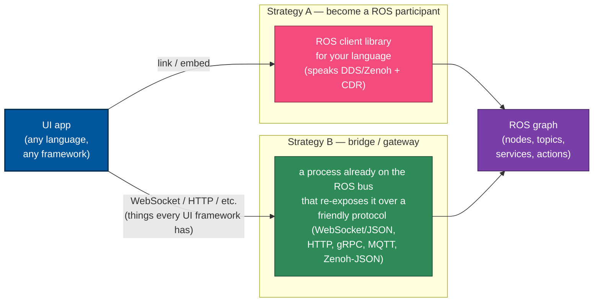

# How a UI app (any language, any framework) talks to ROS 2

Date: 2026-05-29

Conceptual primer underneath the Python-free Flutter analysis chain. The
later docs ([`interbotix-python-cpp-boundary.md`](interbotix-python-cpp-boundary.md),
[`cpp-kinematics-alternatives.md`](cpp-kinematics-alternatives.md),
[`path-b-cartesian-gateway.md`](path-b-cartesian-gateway.md)) all assume
the reader already understands *how* a non-ROS UI reaches a ROS graph at
all. This document answers exactly that, from first principles, so the
gateway design in Path B is motivated rather than asserted.

## The core problem

"ROS communication" is not a single socket protocol. A ROS 2 system is a
set of nodes talking over a **middleware (RMW)** — by default **DDS**
(default vendor: eProsima Fast DDS, `rmw_fastrtps_cpp`), which speaks the
**RTPS** wire protocol over UDP — or **Zenoh** in this project
(`rmw_zenoh`). On top of that middleware sit three more things an outsider
must match:

- a **wire protocol** (RTPS for DDS; the Zenoh protocol for Zenoh),
- a **message serialization** — **CDR**, as mandated by the DDS/RTPS layer,
- a **type + discovery system** — topic/type names, type hashes, QoS;
  DDS discovery is distributed and **multicast by default** (no master),
  which is precisely why it is awkward across WiFi / NAT / containers.

So a UI app cannot talk to ROS merely because it can open a TCP socket. It
must either **get onto that bus** or **get a process already on the bus to
relay for it**. That either/or is the whole answer:

## Strategy A — make your app a first-class ROS node

Use a **ROS client library for your language**, which embeds the
middleware stack so your app *is* a participant on the bus.

- **Official:** `rclcpp` (C++), `rclpy` (Python), `rcl` (the C common core
  under all of them). `rclc` *complements* `rcl` to form a complete C
  client library and is associated with **micro-ROS / embedded** use — it
  is not a general desktop UI library.
- **Community (ROS 2):** `rclnodejs` (Node.js, RobotWebTools), `rclrs` /
  `ros2_rust` (Rust — actively developed but explicitly "no stability
  guarantees"), `ros2_dotnet` (C#/.NET), `rcljava` / `ros2_java`
  (Java/JVM/Android — maintenance looks dated, Galactic-era CI).

**Trade-off:** native and full-fidelity, but heavy — the app depends on a
ROS install (or a vendored DDS/Zenoh stack), needs cooperative networking
(DDS multicast discovery is LAN-oriented and unhappy across WiFi/NAT/
containers), and many UI languages have no maintained, current binding.
This is rarely how a mobile/desktop UI talks to ROS.

> Worth knowing — a hybrid: `roslibrust` (Rust) is pure-Rust with **no ROS
> dependency** and is trait-based with multiple backends (native ROS 1
> TCPROS, native ROS 2 over Zenoh, and the rosbridge protocol). It spans
> Strategy A (Zenoh-native) and Strategy B (rosbridge), so it does not sit
> cleanly in either column.

## Strategy B — a bridge/gateway (what makes it "any language, any framework")

Put a process that *is* a ROS node between your app and ROS, and have it
re-expose the graph over a protocol your UI already speaks. The
requirement then collapses to "can your app open a WebSocket / HTTP / TCP
connection and parse JSON" — which **every** UI framework can.

| Bridge | Protocol to your app | Notes |
|---|---|---|
| **rosbridge_suite** (`rosbridge_server`) | **WebSocket + JSON** (rosbridge protocol v2.1.0); a **TCP** variant also exists | The canonical answer. "rosbridge provides a JSON interface to ROS." Supports ROS 2 (default branch `ros2`). Pub/sub, service calls, and QoS as JSON messages. **This is how most web and many native UIs talk to ROS.** |
| **Foxglove bridge** (in `foxglove/foxglove-sdk`) | Foxglove WebSocket protocol — hybrid (JSON text control + binary frames), CDR-capable for ROS 2 | More efficient than rosbridge JSON; aimed at telemetry/visualization but usable for comms. For ROS 2 the bridge lives in `foxglove-sdk` (the old `ros-foxglove-bridge` repo is ROS 1 only now). |
| **Zenoh** (`zenoh-bridge-ros2dds`, or `rmw_zenoh` directly) | Zenoh pub/sub/query | `zenoh-bridge-ros2dds` bridges a **DDS-based** ROS 2 system to Zenoh; `rmw_zenoh` makes Zenoh the RMW outright. Zenoh has clients in many languages and crosses WiFi/NAT cleanly. |
| **Custom gateway node** | *anything you choose* — REST, gRPC, MQTT, raw TCP, Zenoh-JSON | You write a ROS node that translates the graph into whatever your UI prefers. Maximally flexible; rosbridge is really a pre-built instance of this pattern. |

Client libraries that speak the **rosbridge** protocol (so your app needs
only a WebSocket + JSON, no ROS install): `roslibjs` (browser/Node),
`roslibpy` (Python), `jrosbridge` (Java) — and since it is just JSON over
WebSocket, it is straightforward to hand-roll in any language.

**The key insight:** a bridge converts ROS's middleware + CDR + type
system into a plain, self-describing protocol (usually WebSocket+JSON), so
your UI never needs a ROS library, a DDS/Zenoh stack, or a CDR codec.

## Where this project sits

The Path B design is **Strategy B, custom-gateway flavor**:

- This project's ROS runs on `rmw_zenoh`, so the bus *is already* Zenoh,
  and the phone already speaks Zenoh (`package:zenoh`). So instead of
  adding rosbridge (another process, another protocol), the gateway
  exposes a **plain Zenoh queryable with a JSON schema** and republishes
  state as JSON. Same "translate to a friendly self-describing protocol"
  idea rosbridge uses — just over Zenoh, because Zenoh is already in the
  stack.
- The gateway exists (rather than the phone talking to ROS directly)
  because of the Strategy-A friction documented in
  [`path-b-cartesian-gateway.md`](path-b-cartesian-gateway.md): a raw
  Zenoh client can *read* ROS topics but cannot practically *call* ROS
  services over `rmw_zenoh` (the mandatory attachment/GID/type-hash
  handshake), and there is no CDR library for Dart. The gateway absorbs
  all of that.

**The honest alternative:** the conventional **rosbridge + WebSocket +
JSON** path would let a UI in *any* language talk to ROS with zero
ROS/Zenoh/CDR knowledge — purely a WebSocket+JSON client. The only reasons
this project leans Zenoh-gateway instead are (1) the middleware is already
Zenoh, and (2) keeping one transport end-to-end rather than running a
second bridge. In the abstract, if the goal is the *most* framework-
agnostic "any UI, any language" answer, **rosbridge is it.**

## Decision lens

- **Want truly any-language/any-framework with the least integration
  effort?** → Strategy B with **rosbridge** (WebSocket + JSON). The app
  needs only a WebSocket client and JSON.
- **Already on Zenoh / want one transport / mobile over WiFi?** →
  Strategy B with a **Zenoh-JSON gateway** (this project's Path B).
- **Need tight, low-latency, full-fidelity ROS access and your language
  has a good binding?** → Strategy A (native client library).

## Sources

ROS 2 middleware / serialization / discovery (general):
- https://docs.ros.org/en/humble/Concepts/Basic/About-Client-Libraries.html
- https://docs.ros.org/en/humble/Concepts/Intermediate/About-Different-Middleware-Vendors.html
- https://docs.ros.org/en/humble/Concepts/Intermediate/About-Domain-ID.html (multicast discovery from Domain ID)
- https://docs.ros.org/en/humble/Concepts/Advanced/About-Internal-Interfaces.html (serialized buffer / type support)

Strategy A — client libraries:
- https://github.com/ros2/rclcpp · https://github.com/ros2/rclpy · https://github.com/ros2/rclc
- https://github.com/RobotWebTools/rclnodejs (Node.js)
- https://github.com/ros2-rust/ros2_rust (Rust; "no stability guarantees")
- https://github.com/ros2-dotnet/ros2_dotnet (C#/.NET)
- https://github.com/ros2-java/ros2_java (Java; dated CI)
- https://github.com/Carter12s/roslibrust (multi-backend Rust)

Strategy B — bridges and clients:
- https://github.com/RobotWebTools/rosbridge_suite · https://github.com/RobotWebTools/rosbridge_suite/blob/ros2/ROSBRIDGE_PROTOCOL.md (protocol v2.1.0)
- https://github.com/RobotWebTools/roslibjs · https://github.com/gramaziokohler/roslibpy · https://github.com/WPI-RAIL/jrosbridge
- https://github.com/foxglove/foxglove-sdk (ROS 2 bridge) · https://github.com/foxglove/ws-protocol/blob/main/docs/spec.md (protocol spec; repo archived)
- https://github.com/eclipse-zenoh/zenoh-plugin-ros2dds · https://github.com/ros2/rmw_zenoh
